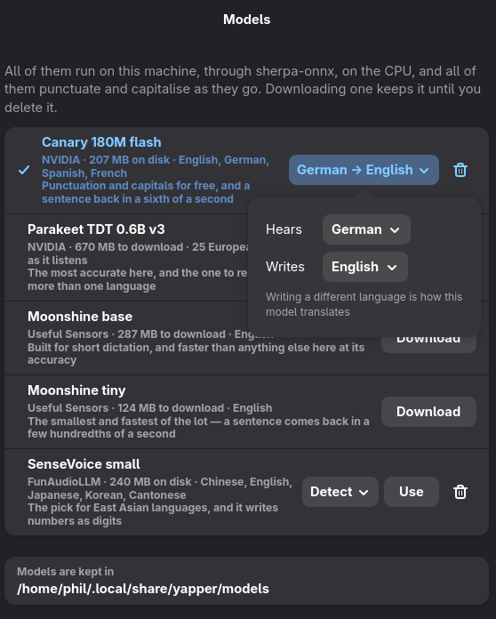

# yapper

Yapper is a small dictation app for Wayland. Press a key, say what you want to
write, and paste the transcript wherever you need it. It records through
PipeWire and transcribes on your machine — with NVIDIA's Canary or Parakeet,
Moonshine or SenseVoice, whichever you pick from the model list. You don't need
an API key, and your audio stays local.

Inspired by [waystt](https://github.com/sevos/waystt), but with a modal window.

[Download the latest release](https://github.com/philjackson/yapper/releases/latest)
· [all releases](https://github.com/philjackson/yapper/releases)

> **A note on the code:** AI was used exstensively to build this.

<p align="center">
  
</p>

The window keeps a list of past transcripts. Select one to copy or delete it.
While you're recording, the bars respond to your voice and a live transcript
appears below the button.

## Install

To build from source, you'll need Rust, GTK4, libadwaita, gtk4-layer-shell, curl
and wl-clipboard. The first build fetches a prebuilt sherpa-onnx, so it needs the
network; the binary it produces does not.

```sh
cargo build --release
install -Dm755 target/release/yapper ~/.local/bin/yapper
install -Dm644 data/dev.yapper.Yapper.desktop \
    ~/.local/share/applications/dev.yapper.Yapper.desktop
```

sherpa-onnx is linked statically, so that binary is the whole program: no
libraries to place, and nothing to install but a model.

There's no model to fetch by hand either — the first run offers the list below
and downloads whichever you choose. curl does the downloading, so it has to be
installed.

## Models

Yapper ships with no model and a list of them instead. Open it from the header
bar menu (**Models…**), from **Model → Choose…** in preferences, or from the
banner the window shows when there is nothing to transcribe with. Each row says
what a model costs and what it speaks; one click downloads it, and the next
loads it — no restart, no file chooser.

A model's language lives on its row, too, because which languages mean anything
is the model's own business. Canary is asked two questions — what it **hears**
and what it **writes**, which is how it translates — SenseVoice is offered its
six or "detect automatically", and Parakeet and Moonshine are asked nothing,
since one detects for itself and the other only knows English.

<p align="center">
  
</p>

| Model | Download | Languages | |
| --- | --- | --- | --- |
| **Canary 180M flash** (NVIDIA) | 207 MB | English, German, Spanish, French | The default. Punctuates and capitalises, and translates between its four |
| **Parakeet TDT 0.6B v3** (NVIDIA) | 670 MB | 25 European | The most accurate, and it works out which language you're speaking |
| **Moonshine base** | 287 MB | English | Built for short dictation |
| **Moonshine tiny** | 124 MB | English | The fastest and smallest here |
| **SenseVoice small** | 240 MB | Chinese, English, Japanese, Korean, Cantonese | Writes numbers as digits |

They all run through [sherpa-onnx](https://github.com/k2-fsa/sherpa-onnx) on the
CPU, and they are quick there: on a desktop CPU, eleven seconds of speech comes
back as a punctuated sentence in 120 ms from Canary, 79 ms from Parakeet and
36 ms from SenseVoice. None of them needs a GPU, and none of them can use one.

Models land in `~/.local/share/yapper/models/`, one directory each, and the list
will delete one for you when you want the disk back.

They transcribe a finished recording rather than decoding as you speak, so the
live transcript works by re-running the model on what it has so far, twice a
second. sherpa-onnx does have genuinely streaming models; none is wired up here
yet.

## Quick capture

Bind `yapper --quick` to a key to start dictating from wherever you're working.
For example, in Hyprland:

```ini
bind = SUPER, D, exec, yapper --quick --copy
bind = SUPER, SHIFT, D, exec, yapper --quick --type
```

Two flags decide what happens to the transcript, and they combine:

| | |
| --- | --- |
| `--copy` | put it on the clipboard |
| `--type` | type it into whatever window has focus, using [wtype](https://github.com/atx/wtype) |
| both | do both |
| neither | keep it in the history and leave everything else alone |

<p align="center">
  
</p>

The panel opens and starts recording straight away. When you're done, press
Enter to transcribe and copy the text to your clipboard. The panel then closes.
Press Escape if you want to discard the recording.

The panel uses layer-shell to stay above other windows, so you don't need a
window rule. Recording starts while the model is loading; you can begin
speaking as soon as the panel opens.

The first launch takes a couple of hundred milliseconds. After that, yapper
stays running in the background with the panel hidden. There's no separate
daemon to set up.

To stop the background process and free the model's memory:

```sh
yapper --stop-daemon
```

## Keyboard shortcuts

| Key | Action |
| --- | --- |
| `Ctrl+Space` | Start recording |
| `Enter` or `Space` | Finish, transcribe and copy |
| `Escape` | Discard the recording |
| `Ctrl+C` | Copy the selected transcript |
| `Delete` | Delete the selected transcript |
| `Ctrl+,` | Open preferences |

You can also toggle recording in an already-open window with
`pkill -USR1 yapper`, which is handy for a separate key binding.

## Settings

Open preferences from the header bar menu or press `Ctrl+,`.

<p align="center">
  
</p>

You can also edit the settings in `~/.config/yapper/config.toml`:

```toml
model = "canary-180m-flash" # a name from the model list
threads = 0                 # 0 chooses based on your CPU count
input_device = ""           # empty uses the system default
copy_to_clipboard = true
type_on_finish = false
history_limit = 200
live_preview = true
silence_timeout = 0.0
silence_threshold = 0.004
pause_players = true

[languages]                      # what each model was told, by model
canary-180m-flash = "de>en"      # hears German, writes English
sense-voice = "auto"             # left to detect
```

**Model (`model`)** names a model from the list above. Choosing one in the
picker downloads it if it isn't here and loads it straight away.

**Languages (`[languages]`)** keeps one entry per model: a language code, or
`hears>writes` when a model is writing a different language than it hears.
It's per model on purpose — `de` is exactly right for Canary and not a language
SenseVoice will accept at all — and a code a model can't use is quietly
replaced by one it can rather than stopping it from loading. Set it in the
model list; there's no need to edit this by hand.

**Pause players (`pause_players`)** pauses media players that support MPRIS while
you dictate, so sound from your speakers is less likely to end up in the
transcript. It resumes them afterwards, but only if they were playing when you
started. This is on by default.

**Silence threshold (`silence_threshold`)** is the level above which yapper
treats sound as speech rather than room noise. The number means nothing on its
own, so preferences has a **Test the microphone** button: press it, talk, and
watch the bar move against the line. Put the line just below where your voice
sits. Raise it if a noisy room keeps recordings running; lower it if quiet
speech gets dropped as silence.

**Silence timeout (`silence_timeout`)** finishes a recording after the number of
quiet seconds you choose. A ring around the button shows the countdown. It's
off by default, since you might just be pausing to think. Try two or three
seconds if you'd like recordings to finish automatically.

**Live preview (`live_preview`)** updates the transcript twice a second while
you talk. Earlier words may change as the model gets more context. When you
finish, yapper transcribes the full recording again and copies that final
version to the clipboard.

**Translation** is Canary only, and it is the same control as its language: set
**writes** to something other than **hears** and it translates between them —
English, German, Spanish or French in any direction.

To type a transcript directly into the focused window, you'll need
[wtype](https://github.com/atx/wtype). The typing button is disabled if it isn't
installed.

## Where files live

| File | Location |
| --- | --- |
| Settings | `~/.config/yapper/config.toml` |
| Models | `~/.local/share/yapper/models/` |
| History | `~/.local/state/yapper/history.jsonl` |

History is stored as JSON Lines, with one transcript per line. You can search
it with grep, and a damaged line won't prevent the other entries from loading.
Only the text is saved; audio is discarded after transcription.

## Releasing

```sh
./scripts/release.sh patch      # or minor, major, or an explicit 0.2.0
```

Bumps the version, builds, tests, tags and pushes; the workflow takes it from
there. It refuses to run from a dirty tree, from anywhere but an up-to-date
`main`, or onto a version that already has a tag or a release, and shows you
what it will do before anything is pushed.

## Todo

- A streaming model, so the live transcript decodes as you speak instead of
  re-running on the whole clip
- Search transcript history in the app
- Adjust the silence threshold automatically
- Add an option to keep audio alongside the text
