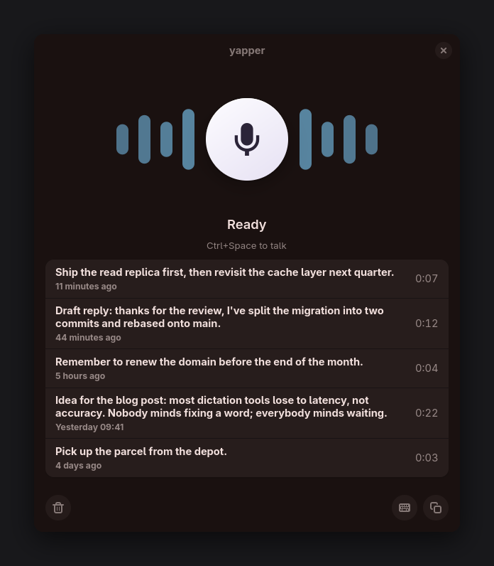
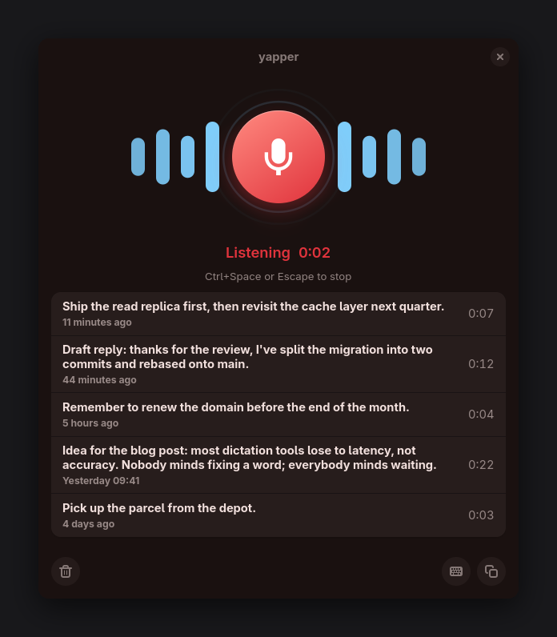
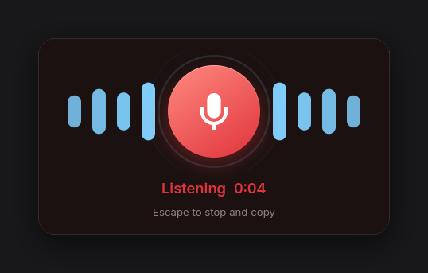
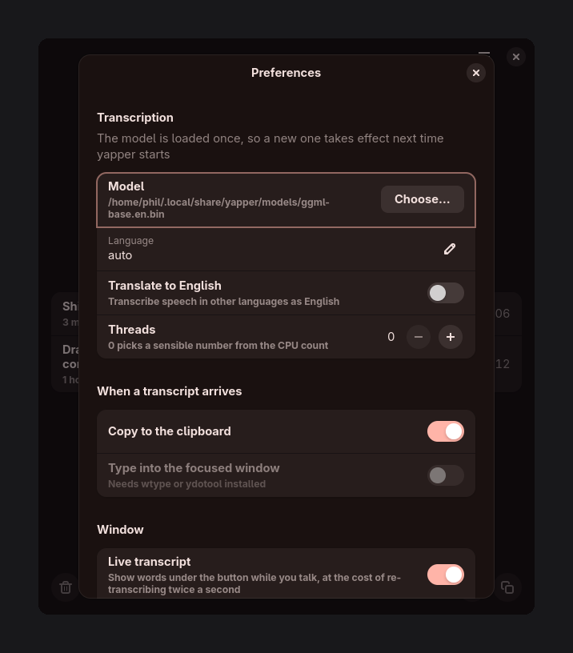

# yapper

Push-to-talk speech-to-text for Wayland, with a small GTK4 window instead of
[waystt](https://github.com/sevos/waystt)'s signal-only interface. Audio is
captured from PipeWire and transcribed on-device by whisper.cpp — nothing leaves
the machine and no API key is needed.

<p align="center">
  
</p>

Every transcript is kept, newest first, and the buttons act on whatever row is
selected. Colours follow the desktop's accent and its light/dark preference.

While you talk, a running transcript appears under the button — yapper
re-transcribes what it has heard so far twice a second, so earlier words can
change as later context arrives. The text that gets copied is a separate, full
pass made once you stop. Turn it off with `live_preview = false` if you would
rather not spend the GPU on it.

While you talk the bars follow your voice; when you stop they settle into a
still shape and the animation stops with them, so an idle window costs nothing.

<p align="center">
  
</p>

## Build

Needs a Rust toolchain plus GTK4, libadwaita, gtk4-layer-shell, cmake and clang
(whisper.cpp is built from source on the first compile, which takes a few
minutes). `wl-clipboard` is required for quick capture and recommended
otherwise.

```sh
cargo build --release
./scripts/fetch-model.sh base.en   # ~148 MB into ~/.local/share/yapper/models
./target/release/yapper
```

To install it properly — on `PATH` and in the application launcher:

```sh
install -Dm755 target/release/yapper ~/.local/bin/yapper
install -Dm644 data/dev.yapper.Yapper.desktop \
    ~/.local/share/applications/dev.yapper.Yapper.desktop
update-desktop-database ~/.local/share/applications
```

GPU inference via Vulkan is on by default. The backend is linked at build time,
so a machine without the Vulkan SDK needs to opt out — and an NVIDIA box can use
CUDA instead:

```sh
cargo build --release --no-default-features              # CPU only
cargo build --release --no-default-features -F cuda      # CUDA instead of Vulkan
```

No code change is involved — whisper-rs turns `use_gpu` on by itself when a GPU
backend is compiled in. Measured here on an RTX 5070 with `base.en`, taking an
11-second clip:

| | Model load | Per transcription |
| --- | --- | --- |
| CPU (default) | 33 ms | ~270 ms |
| Vulkan | 174 ms | ~50 ms |

So inference is roughly 5× faster, against a one-off 140 ms of extra startup.
Worth it for a window you leave open, marginal for a single `--quick` capture at
this model size, and worth more as the model gets bigger. The first run after
building also compiles Vulkan shaders, which takes a few seconds and is then
cached.

## Quick capture

`yapper --quick` is the keybind mode: a floating panel opens already recording,
and closing it puts the transcript on the clipboard.

```
bind = SUPER, D, exec, yapper --quick
```

Press the key, talk, press Escape. The text is on the clipboard by the time the
panel is gone.

<p align="center">
  
</p>

The panel is a layer-shell surface on the overlay layer, so it floats and takes
the keyboard without needing a compositor rule — the same treatment a launcher
like Vicinae gets. On a compositor without layer-shell it falls back to an
ordinary window, which you can float with a rule matching the app id
`dev.yapper.Yapper.Quick`.

Recording starts before the model has finished loading; the audio queues up
behind it. That's the difference between a keybind that feels instant and one
that doesn't.

Because the panel is gone by the time the transcript lands, a desktop
notification confirms it — "Copied 22 words to the clipboard". Copies from the
normal window announce themselves the same way.

Quick capture needs `wl-clipboard` installed. GTK's own clipboard is dropped
when the process exits, which is precisely when you want the text — so yapper
refuses to start in this mode without it rather than losing your words.

## Using it

| Action | How |
| --- | --- |
| Start/stop recording | The microphone button, or `Ctrl+Space` in the window |
| Stop recording | `Escape` |
| Toggle from anywhere | `pkill -USR1 yapper` |
| Quick capture | `yapper --quick` — records on open, copies on close |
| Reuse the text | Copied to the clipboard automatically; `Type` sends it to the focused window |
| Copy an older one | Select its row and press `Ctrl+C`, or use the copy button |
| Delete one | Select its row and press `Delete`, or use the trash button |
| Know it worked | Every copy raises a desktop notification with the word count |

To drive a window that's already open from a key, bind the signal instead:

```
bind = SUPER, SHIFT, D, exec, pkill -USR1 yapper || yapper
```

`Type` needs [`wtype`](https://github.com/atx/wtype) or `ydotool` (with
`ydotoold` running); the button stays disabled when neither is installed.

## Configuration

Everything is in the preferences dialog — the menu in the header bar, or
`Ctrl+,`. Changes save as you make them and take effect on the next
transcription, except the model, which is loaded once at startup.

<p align="center">
  
</p>

The same settings live in `~/.config/yapper/config.toml`, written on first run:

```toml
model_path = "/home/you/.local/share/yapper/models/ggml-base.en.bin"
language = "auto"          # or an ISO code like "en", "de"
translate = false          # translate to English instead of transcribing
threads = 0                # 0 = pick from the CPU count
copy_to_clipboard = true
type_on_finish = false     # type straight into the focused window
history_limit = 200        # how many past transcripts to keep
live_preview = true        # running transcript under the button while you talk
```

Bigger models are more accurate and slower: `tiny.en` (75 MB), `base.en`
(148 MB), `small.en` (488 MB), `medium.en` (1.5 GB), `large-v3` (3.1 GB). The
`.en` models are English-only; drop the suffix for multilingual ones.

## How it fits together

| File | Role |
| --- | --- |
| `src/audio.rs` | cpal capture, channel downmix, resampling to the 16 kHz mono Whisper wants |
| `src/transcribe.rs` | whisper.cpp on a dedicated thread, driven by async channels |
| `src/ui.rs` | The window and the recording state machine |
| `src/stage.rs` | The bars behind the button: layout, easing, and drawing |
| `src/style.css` | The button, status text and transcript frame |
| `src/output.rs` | Clipboard via `wl-copy`, typing via `wtype`/`ydotool` |
| `src/history.rs` | Past transcripts on disk, and the "5 minutes ago" labels |
| `src/config.rs` | `config.toml` handling |
| `src/cli.rs` | Argument parsing |
| `data/…desktop` | Launcher entry, for the normal window |

## Where things live

| What | Where |
| --- | --- |
| Settings | `~/.config/yapper/config.toml` |
| Models | `~/.local/share/yapper/models/` |
| Transcript history | `~/.local/state/yapper/history.jsonl` |

History is JSON Lines — one transcript per line, so it stays greppable and a
single damaged line costs you that entry rather than the file. Only the text is
kept; the audio is discarded once it has been transcribed.

## Not done yet

- A tray icon or a layer-shell overlay instead of a normal window
- Preferences UI — the config file is the only way to change settings
- Searching or editing past transcripts, and keeping the audio alongside them
- Proper voice activity detection (there is only a crude RMS gate that skips silent clips)
